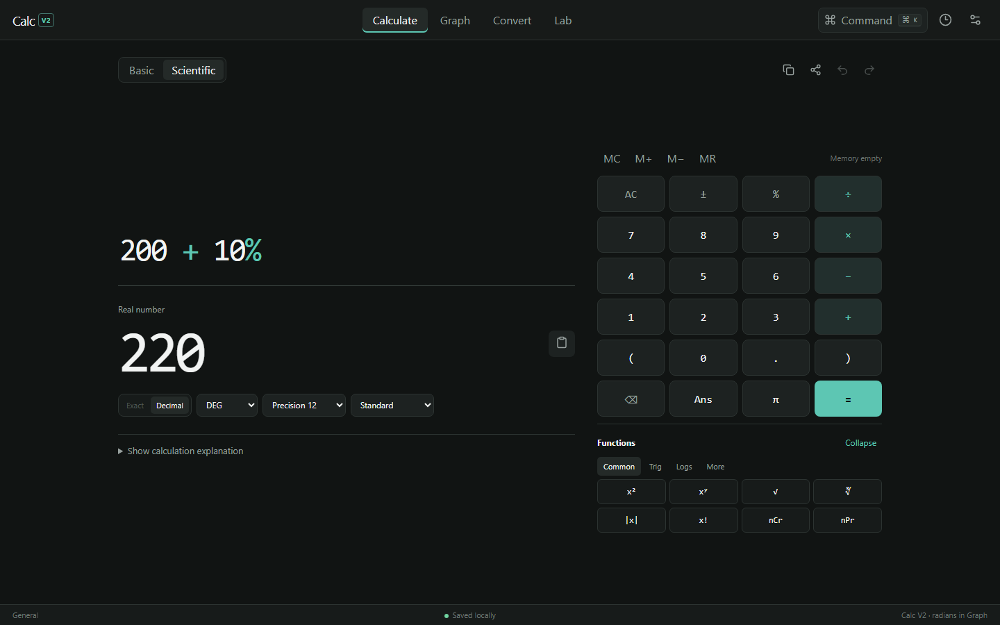
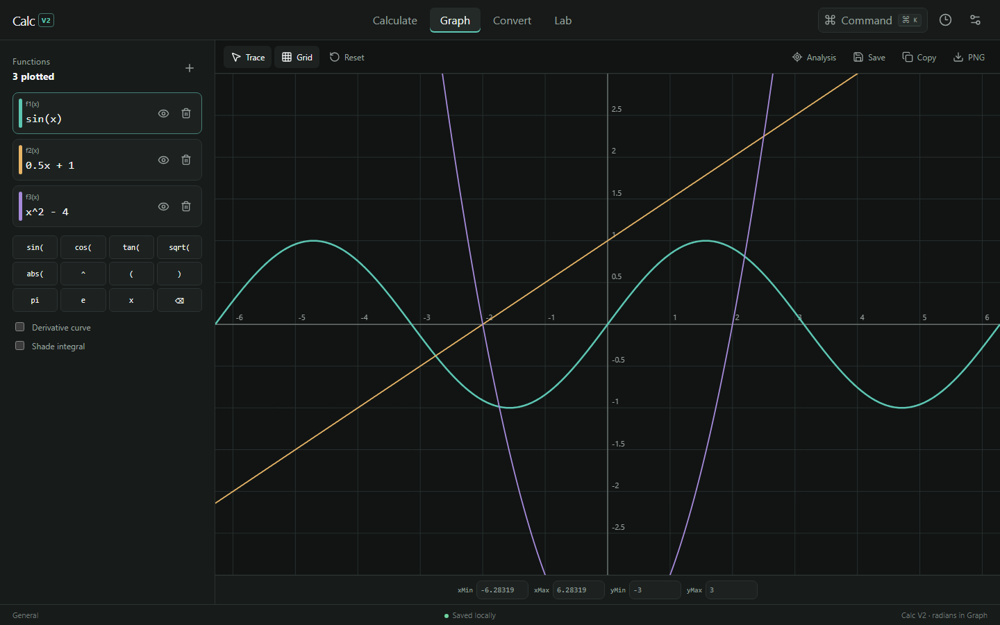
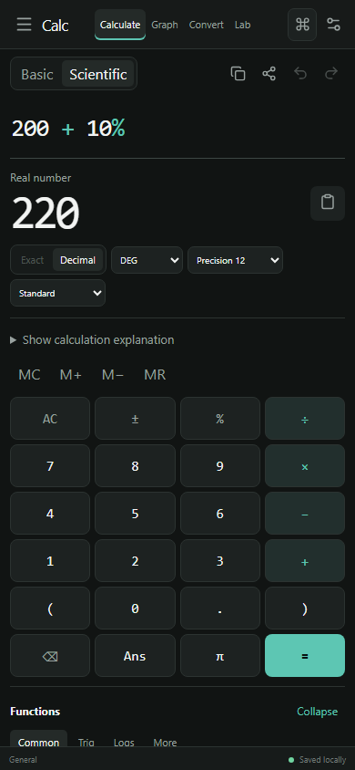
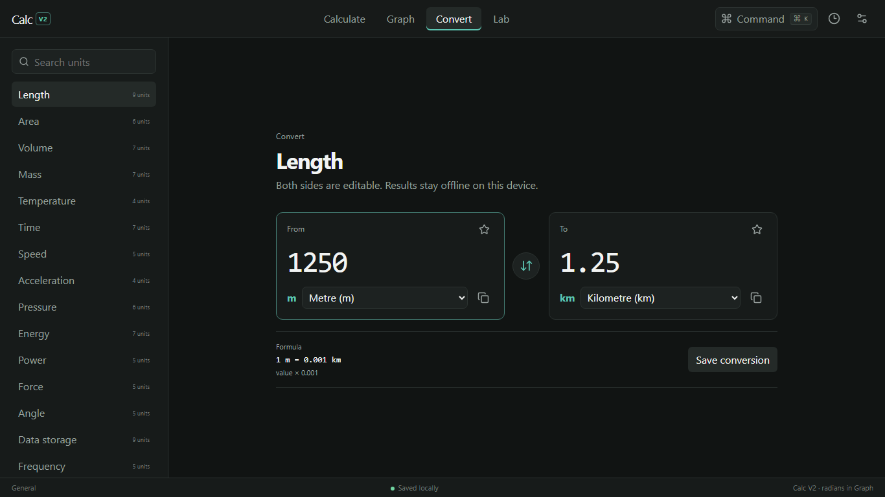

<div align="center">


# Calc V2

### A calm precision instrument for serious thinking.

Scientific calculation, interactive graphing, offline unit conversion, and focused mathematical tools—inside one local-first workspace.

<br />

<a href="https://calc-v2-pi.vercel.app/">
  
</a>

<br /><br />

**Nothing to install. No account. Just press the button and calculate.**

[Live app](https://calc-v2-pi.vercel.app/) · [Report an issue](https://github.com/SatyajitBeura2468/Calc_v2/issues)

</div>



## What is Calc V2?

Calc V1 is deliberately small and simple. Calc V2 is the advanced companion: a full calculation environment that stays understandable even when the work becomes complex.

Everything runs in the browser. Calculations, workspaces, history, preferences, and favourites are stored locally on your device; there is no account system, backend, API key, or analytics requirement.

## Four focused modes

| Mode | What it does |
| --- | --- |
| **Calculate** | Editable expressions, live preview, Basic/Scientific controls, exact fractions, three angle modes, memory, undo/redo, result formats, and shareable calculation links. |
| **Graph** | Multiple functions, pan, wheel/pinch zoom, tracing, numeric axes, roots, intersections, extrema, derivatives, bounded integrals, and PNG export. Graph trigonometry always uses radians. |
| **Convert** | Two editable fields, search, favourites, recent units, formulas, validation, and 16 offline unit categories. |
| **Lab** | Complete equation, matrix, statistics, and programmer tools—no placeholder tabs. |

<table>
  <tr>
    <td width="66%"></td>
    <td width="34%"></td>
  </tr>
</table>

<details>
<summary><strong>See the converter</strong></summary>
<br />

</details>

## Useful shortcuts

| Shortcut | Action |
| --- | --- |
| `Enter` | Calculate and save the result |
| `Ctrl/Cmd + K` | Open the command palette |
| `Ctrl/Cmd + H` | Open workspaces and history |
| `Ctrl/Cmd + ,` | Open settings |
| `Ctrl/Cmd + Z` | Undo expression edit |
| `Ctrl/Cmd + Shift + Z` or `Ctrl/Cmd + Y` | Redo expression edit |
| `Esc` | Close a dialog, drawer, or command palette |

## Run it on your computer

You only need [Node.js](https://nodejs.org/) installed.

```bash
git clone https://github.com/SatyajitBeura2468/Calc_v2.git
cd Calc_v2
npm install
npm run dev
```

Open the local address printed in the terminal—usually `http://localhost:5173`.

## Quality checks

```bash
npm test          # unit and component tests
npm run lint      # code-quality checks
npm run build     # production build
npm run test:e2e  # Playwright browser flows
```

To capture the maintained README and viewport QA images while a local server is running:

```bash
npm run capture:visuals
```

## Technology

React 19 · TypeScript · Vite · Math.js · Canvas 2D · Vitest · Testing Library · Playwright

The app is intentionally backend-free, dependency-conscious, keyboard-accessible, responsive from 360 px phones to wide desktops, and respectful of reduced-motion preferences.

## Privacy and local data

Calc V2 does not require an account. Your history and settings stay in browser storage. The History drawer can export a versioned JSON backup or a CSV table, and imported backups are validated before use. Clearing browser site data will remove local Calc V2 data unless you export a backup first.

---

<div align="center">

Built by [Satyajit Beura](https://github.com/SatyajitBeura2468) as the advanced evolution of Calc V1.

**[Open Calc V2 →](https://calc-v2-pi.vercel.app/)**

</div>
